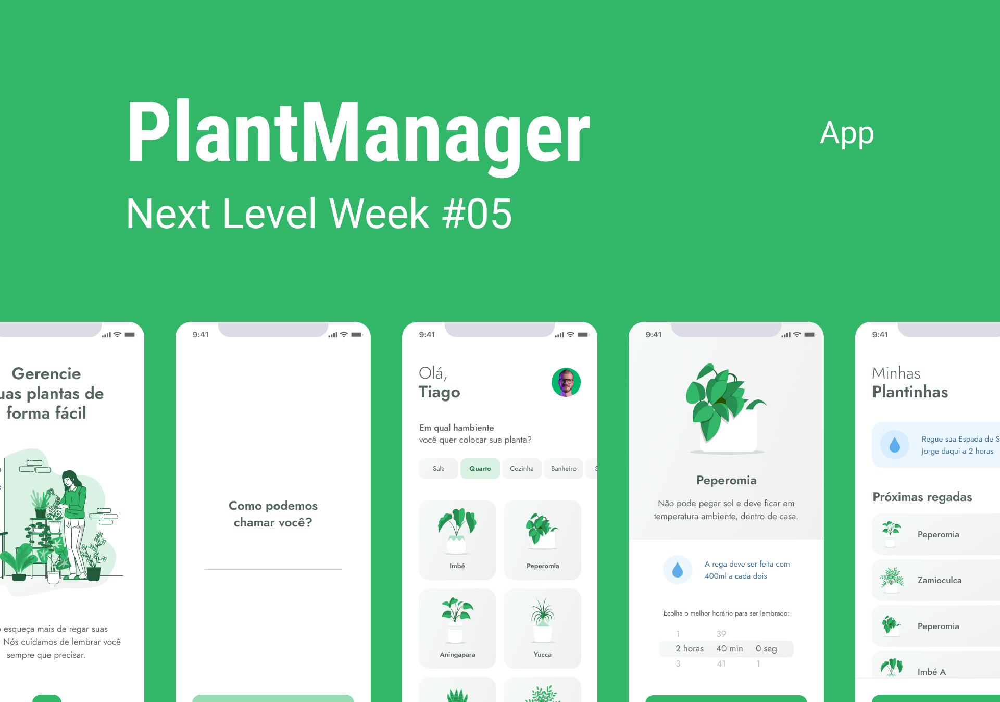

<div align="center">
  
  <h1>PlantManager</h1>
  <p>🌱 Application to remind people to water their plants 🌱</p>
  <p>
    <a href="https://www.linkedin.com/in/samira-costa" target="_blank" rel="noopener noreferrer">
      
    </a>          
  </p>
</div>

# 👀 About

Several places use plants, be it their home or business, and nowadays the human being is more and more busy, so he ends up forgetting to water his plants. Plantmanager came to solve this problem, with this application you will know when and how to water your plants !!

<div align="center">
   
</div>

<br>
<br>


# 🚀 Technologies

  - [Node.js](https://nodejs.org/en/)
  - [Expo](https://expo.io/)  
  - [React Native](https://reactnative.dev/)
  - [TypeScript](https://www.typescriptlang.org/)
  - [ESlint](https://eslint.org/)
  - [Prettier](https://prettier.io/)
  - [EditorConfig](https://editorconfig.org/)


## 💻 Getting started

### Requirements

- [Node.js](https://nodejs.org/en/)
- [Expo](https://expo.io/)  
- [Yarn](https://classic.yarnpkg.com/) or [NPM](https://www.npmjs.com/)

### Installing and running the project

*Clone the project and access the folder*

```bash
$ git clone https://github.com/samiraetc/plantmanager 
$ cd plantmanager
```

*Follow the steps below*

```bash
# Install the dependencies
$ yarn install
# Make a copy of '.env.example' to '.env'
# and set with YOUR environment variables.
$ cp .env.example .env
# Finally, run the api service in a development environment :)
$ yarn start
# Well done, PlantManager is started!
```
<br>

